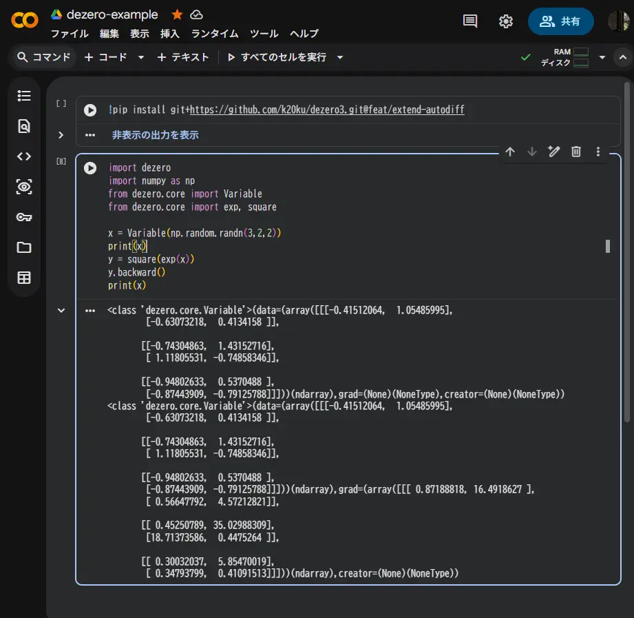
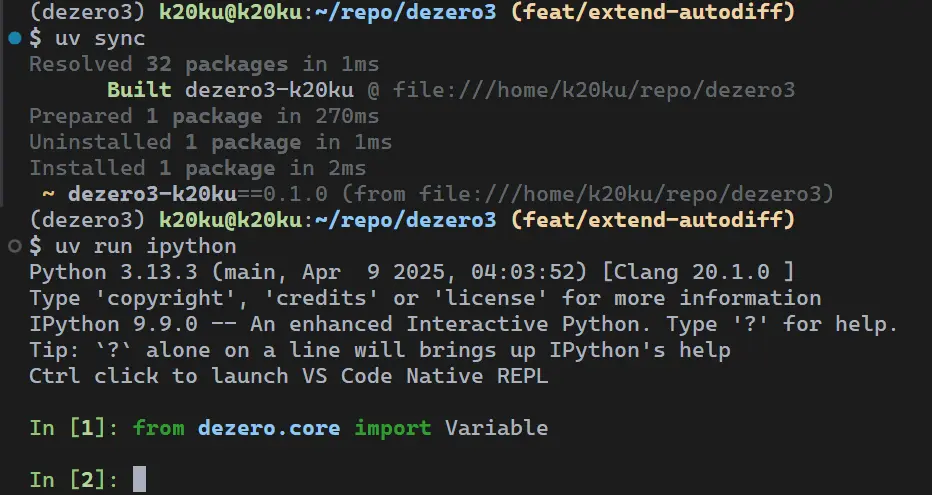

# dezero3

Deep Learning Framework repository based on "Deep Learning from Scratch 3" by 斎藤康毅([koki0702](https://github.com/koki0702))

『ゼロから作る Deep Learning ③』をベースにした、自動微分ライブラリの実装リポジトリ。

- 型ヒント・プロジェクト構成・テスト環境を整備しながら、自動微分エンジンの内部構造を理解することを目的としている。
- 現在は Function Evaluation 周辺まで実装済みで、計算グラフと逆伝播の基盤部分を構築中。

## Developer Notices

- **Developers shuold make `venv` activated**.

```bash
uv venv
source .venv/bin/activate
```

- Setting Up dependencies

```bash
uv sync
```

## Run Dezero

```bash
uv run main.py
```

### Run in Colab



### Run in IPython REPL



```bash
uv run ipython
```

You can make REPL responsive to module-file changes

```python
%load_ext autoreload
%autoreload 2
```

You can run specific script file (i.e. `main.py`) on the REPL.

```python
%run main.py
```

### Tests Dezero

To run all test,

```bash
pytest
```

To test specified class or functions (i.e. `class TestSquare` in `tests/core_test.py`)

```bash
pytest tests/core_test.py::TestSquare
```

## Motivation

- 自動微分の仕組みを理解する
- Python の型システムを活用する
- ライブラリとして保守しやすい構成にする
- 実装の背景にある設計を追う

ニューラルネットワークそのものよりも、

- Variable
- Function
- Computation Graph
- Automatic Differentiation

といった基盤技術に興味があり、その理解を目的として実装している。

## Development Process

- 書籍ではステップごとのスクリプトとして実装が進む
- このリポジトリでは最初からライブラリとして利用できる構成を採用している。

構成を考える際には、

- DeZero
- NumPy
- Chainer
- PyTorch

などのリポジトリを参考にしている。

また、環境管理には [uv](https://docs.astral.sh/uv/) を利用している。

1. 実装済み
        - Variable
        - Function
        - Computation Graph
        - Backward Propagation (basic)
        - Gradient Checking

2. 実装中
        - Add / 複数入力演算
        - Weak Reference
        - 高階な自動微分機能
        - CNN 関連ユーティリティ

## Improvements

### 1. 型ヒント

このリポジトリでは型ヒントを積極的に導入している。
ただし、すべてを厳密に型付けするのではなく、

- 内部実装は厳密に
- 利用者向け API は柔軟に

という方針を採っている。

Example:

強く型付けしているものは，

- `Variable`
- `Function`
- grad
- 計算グラフ内部

一方で利用者は，

```python
def rosenbrock(x0, x1):
    return 100 * (x1 - x0 ** 2) ** 2 + (x0 - 1) ** 2
```

のような Python らしい記述を損なわないことも重視している。

### 2. テストフレームワーク

- 書籍では標準の unittest が利用されている
- このリポジトリでは pytest を採用している。

- **理由**:
        - パラメータ化テストが容易
        - テストの追加がしやすい
        - テストケース数が増えても管理しやすい

## Learnings

### 1. Reference and Pointer

計算グラフでは参照やポインタをいかに効率よく安全に扱うかが重要

そのため、

- Variable の参照
- Function の参照
- Numpy 配列の view や 参照
- 循環参照
- Weak Reference

といったオブジェクト構造を意識しながら実装している。

### 2. Auto-Grad (自動微分) and Numerical Diff (数値微分)

数値微分は正しさの検証には便利だが、大規模なニューラルネットワークでは現実的な速度で動作させるのは困難。

そのため、このリポジトリでは数値微分を勾配検証に利用しつつ、自動微分による効率的な逆伝播の実装を進めている。

その際，数値微分もkoki氏の数値微分を最適化したコードを参考にしている．加えて型付けと細かい変更を加えている．これからも修正予定である．

### 3. Respect to Chainer, PyTorch, Tensorflow

実装を追う中で、DeZero の多くの設計が Chainer の影響を受けていることを知った。

特に後半で登場するユーティリティ関数や GPU 対応コードについては、Chainer の実装を参考にしながら理解を進めている。

一方でフレームワーク全体の方針は，現代のPyTorchやTensorflowを参考にしている（型付けの方針など）．成熟しているため方向性がぶれにくいからである．

